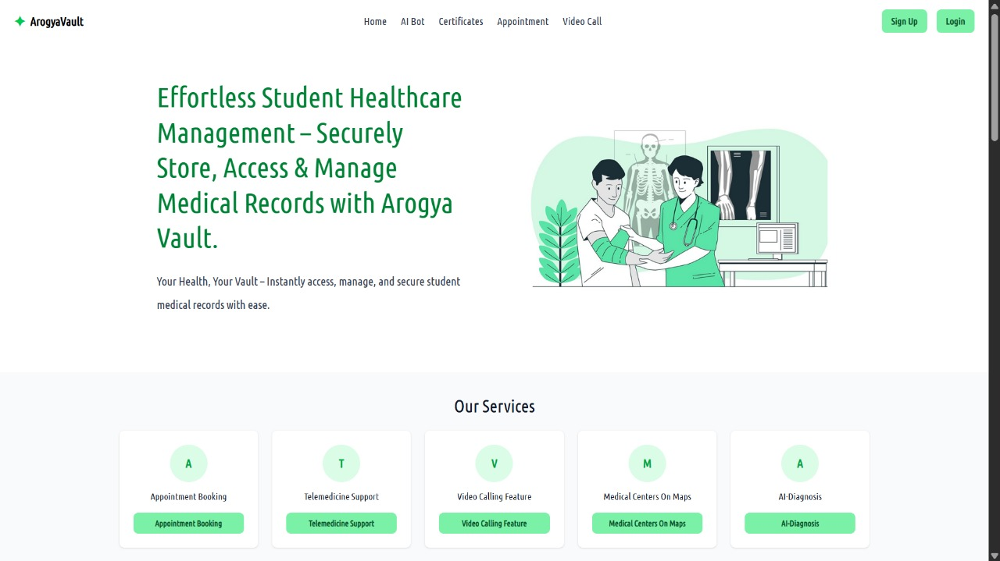
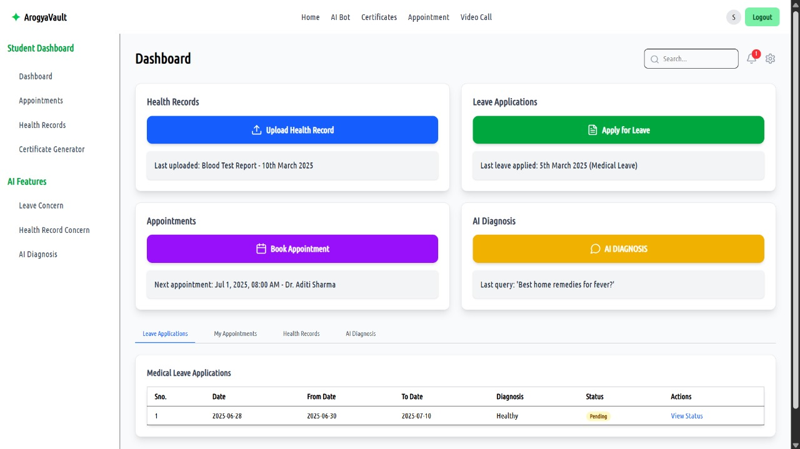
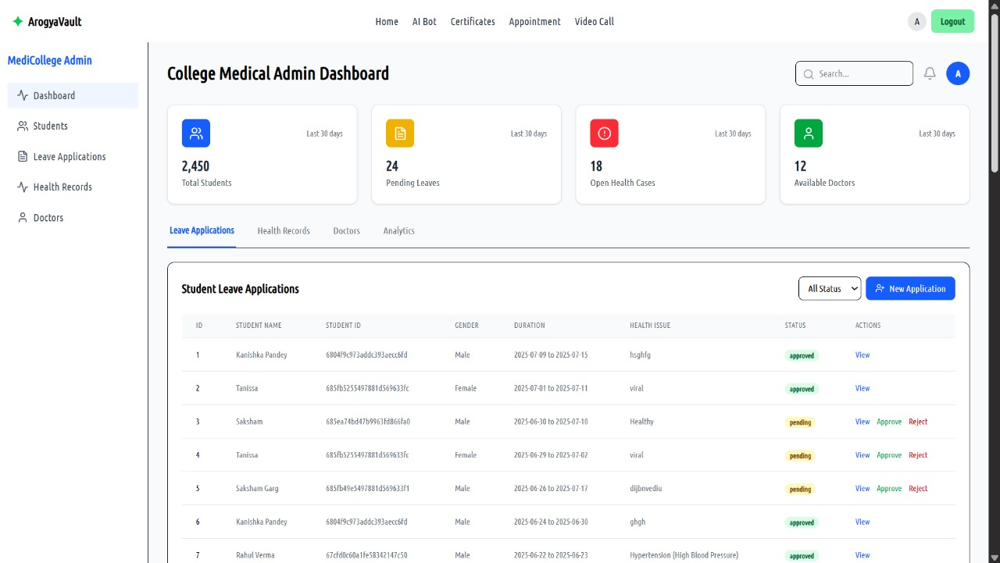
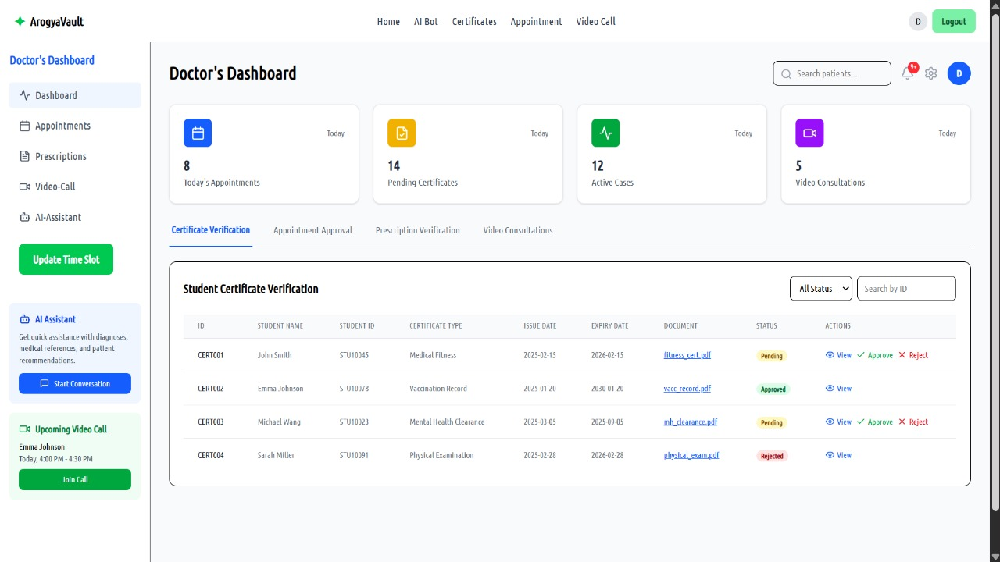

# ArogyaVault - Digital Healthcare Management System

A comprehensive healthcare management platform designed for educational institutions to streamline health record management, appointment scheduling, and medical leave processing.

## 🚀 Key Features

- **Health Record Management** - Secure storage and retrieval of student health records
- **Appointment Scheduling** - Book doctor consultations with in-app video calls
- **Digital Leave Application** - Paperless medical leave requests and approvals
- **Voice-Enabled Assistance** - Hands-free operation using voice commands
- **AI-Powered Diagnosis** - Symptom analysis and health insights
- **Real-Time Notifications** - Alerts for appointments and leave status
- **Blockchain Integration** - Tamper-proof medical certificate storage on Polygon
- **Telemedicine** - Built-in video consultation capabilities

## 🛠️ Tech Stack

### Frontend
- React.js 18
- Vite
- Tailwind CSS
- React Router DOM
- Web3.js / Viem (Blockchain integration)
- Socket.IO Client (Real-time updates)

### Backend
- Node.js with Express
- MongoDB (Database)
- JWT Authentication
- Socket.IO (WebSockets)
- Cloudinary (Media storage)

### AI/ML
- Python with Flask
- TensorFlow/PyTorch (for symptom analysis)

### Blockchain
- Solidity (Smart Contracts)
- Polygon Network
- Web3.js / Ethers.js

## 🚀 Getting Started

### Prerequisites

- Node.js (v18+)
- Python (v3.8+)
- MongoDB (local or cloud instance)
- npm or yarn

### Installation

1. **Clone the repository**
   ```bash
   git clone https://github.com/SakshamGarg16/ArogyaVault.git
   cd ArogyaVault
   ```

2. **Set up the Backend**
   ```bash
   cd Backend
   npm install
   cp .env.example .env  # If exists, or create a new .env file
   # Update .env with your configuration
   npm run dev
   ```

3. **Set up the Frontend**
   ```bash
   cd ../Frontend
   npm install
   cp .env.example .env  # If exists, or create a new .env file
   # Update .env with your configuration
   npm run dev
   ```

4. **Set up the AI Server** (if applicable)
   ```bash
   cd ../Backend/ai
   python -m venv venv
   source venv/bin/activate  # On Windows: venv\Scripts\activate
   pip install -r requirements.txt
   python app.py
   ```

## 🔧 Environment Variables

### Backend (`.env`)
```env
PORT=5000
MONGODB_URI=your_mongodb_uri
JWT_SECRET=your_jwt_secret
CLOUDINARY_CLOUD_NAME=your_cloudinary_name
CLOUDINARY_API_KEY=your_cloudinary_key
CLOUDINARY_API_SECRET=your_cloudinary_secret
```

### Frontend (`.env`)
```env
VITE_API_URL=http://localhost:5000
VITE_SOCKET_URL=ws://localhost:5000
VITE_POLYGON_RPC=your_polygon_rpc_url
VITE_CONTRACT_ADDRESS=your_smart_contract_address
```

## 📁 Project Structure

```
ArogyaVault/
├── Frontend/              # React frontend
│   ├── public/            # Static files
│   └── src/               # Source code
│       ├── components/    # Reusable components
│       ├── pages/         # Page components
│       ├── context/       # React context
│       ├── hooks/         # Custom hooks
│       └── utils/         # Utility functions
│
├── Backend/               # Node.js backend
│   ├── controllers/       # Route controllers
│   ├── models/            # MongoDB models
│   ├── routes/            # API routes
│   ├── middlewares/       # Express middlewares
│   ├── services/          # Business logic
│   └── ai/                # AI server
│
└── smart-contracts/       # Solidity smart contracts
```

## 🔄 How It Works

1. **User Authentication**
   - Students and staff register/login using institutional credentials
   - JWT-based authentication for secure access

2. **Health Records**
   - Students can upload and manage their health records
   - Role-based access control for sensitive information

3. **Appointment Booking**
   - View available doctors and time slots
   - Book appointments with preferred healthcare providers
   - Receive real-time notifications

4. **Leave Management**
   - Submit medical leave applications
   - Attach digital prescriptions/certificates
   - Track application status in real-time

5. **AI Assistant**
   - **Medical History Assistant**
     - Answers student queries about their medical history
     - Provides explanations of medical terms and conditions
     - Retrieves and summarizes past health records
   - **Leave Management Assistant**
     - Answers questions about leave history and status
     - Explains leave policies and requirements
     - Provides updates on pending and approved leaves
   - **Doctor's AI Assistant**
     - Offers medical insights for healthcare professionals
     - Analyzes patient data and suggests diagnoses
     - Provides treatment recommendations based on medical records

6. **Blockchain Integration**
   - Store medical certificates on Polygon blockchain
   - Verify document authenticity
   - Immutable record keeping

## 📸 Screenshots

### Health Records


### Dashboard


### Appointment Booking


### AI Assistant


## 🤝 Contributing

1. Fork the repository
2. Create your feature branch (`git checkout -b feature/AmazingFeature`)
3. Commit your changes (`git commit -m 'Add some AmazingFeature'`)
4. Push to the branch (`git push origin feature/AmazingFeature`)
5. Open a Pull Request

## Backend Setup
1. Navigate to the backend directory:
   ```sh
   cd backend
   ```
2. Install dependencies:
   ```sh
   npm i
   ```
3. Create a `.env` file in the `backend` directory and add the following:
   ```env
   PORT=<YOUR_PORT>
   MONGO_URI=<YOUR_MONGO_URI>
   JWT_SECRET=<YOUR_JWT_SECRET>
   
   # Cloudinary
   API_KEY=<YOUR_CLOUDINARY_API_KEY>
   API_SECRET=<YOUR_CLOUDINARY_API_SECRET>
   CLOUD_NAME=<YOUR_CLOUDINARY_CLOUD_NAME>
   
   # Gemini API
   GEMINI_API=<YOUR_GEMINI_API_KEY>

   # Email id to send Email Notifications
   EMAIL_USER=<YOUR_EMAIL_ID>
   EMAIL_PASS=<YOUR_PASSWORD>
   ```
4. Start the backend server:
   ```sh
   npm run dev
   ```

## AI Setup
1. Navigate to the backend directory:
   ```sh
   cd backend/ai
   ```
2. Install dependencies:
   ```sh
   python -r requirements.txt
   ```
3. Start the ai server :
   ```sh
   python app.py
   ```


## Running the Project
Ensure all three servers (frontend, backend, and AI) are running simultaneously. The frontend will communicate with the backend via the API URL specified in `.env`.
You're now set up to develop and test the project locally!

